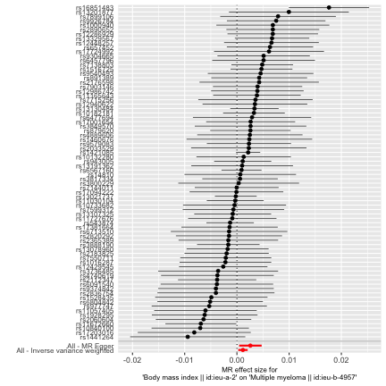
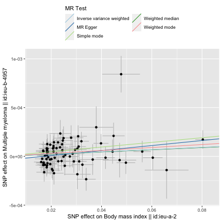
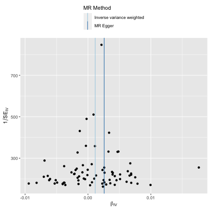
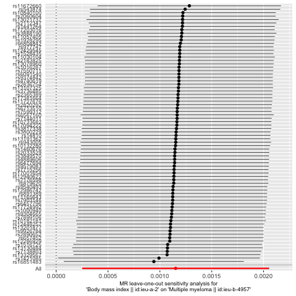

```
## Error in library(Cairo): there is no package called 'Cairo'
```

# Two sample MR report

---

## Body mass index || id:ieu-a-2 against Multiple myeloma || id:ieu-b-4957

Date: **17 March, 2023**

---

### Results from two sample MR:


|method                    | nsnp|         b|        se|      pval|
|:-------------------------|----:|---------:|---------:|---------:|
|MR Egger                  |   76| 0.0025785| 0.0011001| 0.0217759|
|Weighted median           |   76| 0.0011321| 0.0007134| 0.1125392|
|Inverse variance weighted |   76| 0.0011525| 0.0004602| 0.0122649|
|Simple mode               |   76| 0.0023965| 0.0015313| 0.1217962|
|Weighted mode             |   76| 0.0015226| 0.0009146| 0.1001150|

---

### Heterogeneity tests


|method                    |        Q| Q_df|    Q_pval|
|:-------------------------|--------:|----:|---------:|
|MR Egger                  | 79.83015|   74| 0.3009457|
|Inverse variance weighted | 82.02067|   75| 0.2708243|

--- 

### Test for directional horizontal pleiotropy


| egger_intercept|       se|      pval|
|---------------:|--------:|---------:|
|       -4.34e-05| 3.04e-05| 0.1583696|

--- 

### Test that the exposure is upstream of the outcome


| snp_r2.exposure| snp_r2.outcome|correct_causal_direction | steiger_pval|
|---------------:|--------------:|:------------------------|------------:|
|       0.0151607|      0.0002386|TRUE                     |            0|

Note - R^2 values are approximate

---

### Forest plot of single SNP MR



---

### Comparison of results using different MR methods



---

### Funnel plot



---

### Leave-one-out sensitivity analysis


